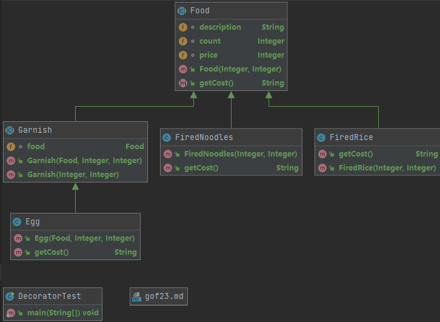

Gof23： Gang of Four (四人帮)

分创建型：5种、结构型：7种、行为型：11种。

快速记忆：
创 公园,但见愁。(创造型：  工厂、原型、*** 单例、建造者、抽象工厂)
姐 想外租,世代装侨。(结构型： 享元、外观、组合、*** 适配器、代理、装饰者、桥接)
形 状折中模仿,戒备观测鸣笛。(行为型： 状态、责任链、中介、模板方法、访问、*** 解释器、备忘录、观察者、策略、命令、迭代)

结构型:  (最新特别理解：静态代理是继承并对引入目标对象的增强；装饰是继承和引入目标对象的组合；桥接是两个抽象方向的组合；适配器需要新增适配器方法，传入适配器，适配器引入被适配对象，执行被适配方法。)
    桥接模式：(理解1：相似模式,适配器模式;  弱弱分不清到底谁是谁。 桥接模式更多的是A和B两者互相搭配成一种全新结构，而适配器是A去适配B。
             理解2：两个维度的横向扩展，比如支付方式和支付渠道。一个维度A做实现,一个维度B做抽象接口继承，并将A维度抽象传入B维度内，结合使用。)
            (思考了下，想要用适配器模式来实现桥接的功能。想做两个抽象，会发现非常复杂，不如桥接。适配器更适合，一个方向固定，新增适配器方法，引入适配器)
    适配器模式：(理解1：通常A去适配B,一端方向固定，几乎无扩展,像电脑网线接口B，需要专门适配器A。B需要单独开一个适配的接口，方便进行适配。而桥接是不需要新增的)
            (理解2：适配器是新增方法去做功能的适配，达到其余类也能使用被适配类的功能。 桥接是不改变原始方法，将两个方向维度搭配成一个全新结构使用。)
            (理解3：适配器分类的适配器和对象的适配器。对适配器做一层抽象，该方法为目标对象需要的方法。满足开闭原则)
    装饰模式：分两类A、B组合。A为超级父抽象类，B类继承自A，引入A形成套娃模式。区别于(桥接模式、 适配器模式、 代理模式)
    
            (理解1：装饰者和静态代理，都继承或者**实现目标对象，引入目标对象**。静态代理只是单纯的加强并且隐藏目标对象，装饰者是增强对象，并且拥有一种继承链的概念。)
            (理解2：装饰者、静态代理、适配器：装饰者和静态代理都是对继承、实现目标对象，对目标对象方法做增强。桥接，更多的是目标对象和源对象的各自方法的组合。)
    代理模式：* 静态代理：主要引入被代理对象，或者继承。重写方法或者新增相同方法添加代理逻辑。(引入对象可以使用set方法，或者构造器，spring和alibaba不建议构造器。)
            * 动态代理：区分为：cglib 和 javassist 和 jdk三种实现 (1)jdk：基于接口的 (2)cglib:基于类的 (3)javassist:java字节码实现
            (**JDK**： Proxy.newProxyInstance(ClassLoader, Interface, InvocationHandler),  使用lambda和分类使用
            Handler类，构造器传入被代理对象，面向接口的。method执行构造传入的对象invoke方法。
            Proxy代理类: getProxy(Object obj) 传入的为需要代理的对象。 方法内部调用Proxy.newProxyInstance()，业务端调用即可。)
            (**Cglib**： 步骤一：实现MethodInterceptor,做代理实现MethodProxy.invokeSuper(); 步骤二：Enhancer enhancer.superClass() 和 
            callBack(代理) 和create()用被代理对象接收.理解为先设置父级被代理类;再设置代理Interceptor，最后创建接收，执行方法。),
    外观模式：将A、B、C、D到统一到外观类里面，相当于引入全部A、B、C、D变量，然后外观方法初始化变量，接着通过各种实现方法实现各变量功能。
            缺点：不符合开闭原则，修改麻烦。
            使用场景：类似controller调service；引入各种Dao调用一样，也类似网关。
            源码：tomcat作为web，会将请求信息封装成ServletRequest对象， 还有HttpServletRequest对象。实际是RequestFacade对象，聚合了Request对象。
            (理解：外观里面封装、聚合其他业务类，门面模式类会自动去调用具体的业务逻辑)
    组合模式:套娃模式，主要适用于文件夹、文件遍历；树状结构。主要分：树干（公共方法、属性）、树枝（结合树干和树叶）、树叶(无法再继续拆分)。
            (分安全模式和透明模式；安全模式，就树干只提完全公共的；透明模式：不管是否完全公共，都提到抽象类，满足依赖倒置原则，树叶部分空实现即可)
    享元模式：主要在于共享通⽤对象，减少内存的使⽤，提升系统的访问效率。⽽这部分共享对象通常⽐较耗费内存或者需要查询⼤量接⼝或者使⽤数据库资源，因此统⼀抽离作为共享对象使⽤。
            (理解：通过区分不同数据，公共部分可以提出公共对象，做封装缓存。)
            (源码使用场景：String、Integer<编译后会发现Integer a = 127; 实际为:Integer.valueOf(127)>、Long<不能设置默认最大值了>、)
            (源码理解链接：https://juejin.cn/post/6844903683860217864#heading-10)
行为型:
        行为型模式用于描述程序在运行时复杂的流程控制，即描述多个类或对象之间怎样相互协作共同完成单个对象都无法单独完成的任务，它涉及算法与对象间职责的分配。
        行为型模式分为类行为模式和对象行为模式，前者采用继承机制来在类间分派行为，后者采用组合或聚合在对象间分配行为。由于组合关系或聚合关系比继承关系耦合度低，
        满足“合成复用原则”，所以对象行为模式比类行为模式具有更大的灵活性。
    状态模式：思想为一个所有状态抽象类包含所有抽象方法，接着所有状态的实现类，实现全部抽象方法，各个抽象方法实现即状态下实现是否能做相关处理;帮助类对外提供方法，
            构造器初始化时，将所有枚举状态和实现类享元，对外提供所有状态执行方法。
    责任链模式： 有一种同类型结构无限链表的形式思想在里面，即如果下一个节点不存在，则处理完当前流程校验则提前结束，否则继续链表操作。一个抽象类，放入顶级抽象本身。
    中介者模式：更多的是一种封装的思想，比如某个模块的功能统一封装一个中台服务，或者类。以后统一该获取都走服务或者类就可以了，内部实现对外不可见，只需要统一调用即可。
            像ORM框架的实现。
    模板方法模式：理解核心: 通过在抽象类中定义抽象方法的执行顺序，并且将抽象方法定义好，并且只能子类实现，但不给设计独立的访问方法。权限由抽象类把控。
xxxx    访问者模式：区别于命令模式，理解模糊，感觉可以应用于现象对象的数据过滤。(校长和家长希望看到的学生和老师的数据情况不一样为例)

===========================================
    解释器：
    备忘录： 版本回滚undo、当前版本redo、get、append; 比如文件版本
    观察者：消息队列的绑定和通知实现思想。订阅、取消订阅这套。角色分：Listener接口实现topic监听类；管理订阅、取消、通知的帮助类EventManager(正常是将所有枚举的监听初始化到Manager)；
            订阅可以做全局的也可以做临时的，业务使用的时候引入Manager进行通知即可。
    策略模式：简单理解策略模式，就是对接口的多种实现，多态。(例如lambda的实现原理、)
    命令模式： 理解：命令、实现、调用者。个人理解和生产者、消费者很像，只是先把命令收集一起，最后再执行。比如下令的时候将命令存放缓存，执行的时候从缓存拿出执行实现，介质为调用者。
            (将命令先输入，最后再执行，即先把指令存储到享元，接着将数据下令执行)
    迭代器模式：
